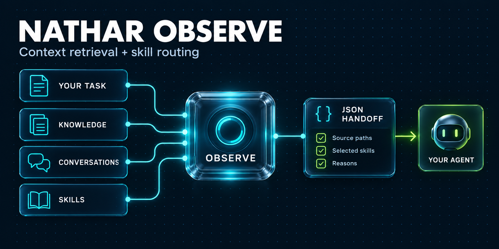
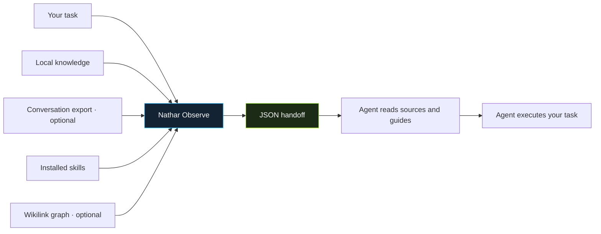

<p align="center">
  
</p>

<h1 align="center">Nathar Observe</h1>

<p align="center"><strong>Context retrieval and explainable skill routing for AI agents.</strong></p>

<p align="center">
  <a href="https://github.com/abuegab1-spec/nathar-observe/actions/workflows/tests.yml"></a>
  
  <a href="LICENSE"></a>
  
</p>

<p align="center">
  <a href="#quick-start">Quick start</a> ·
  <a href="docs/README.ar.md">العربية</a> ·
  <a href="skills/nathar-observe/SKILL.md">Agent skill</a> ·
  <a href="docs/integration.md">Integration guide</a>
</p>

---

## Give your agent the context it needs

Nathar Observe takes a task, finds relevant local knowledge and conversation excerpts,
and selects installed `SKILL.md` guides. It returns source paths, selection reasons,
excluded candidates, and a handoff for the agent that will execute the task.

It runs as a CLI or Python library. It requires no agent framework, account, gateway,
API key, or container. Any agent that can run a command or consume JSON can use it.

| Find the context | Choose the guides | Explain the handoff |
| --- | --- | --- |
| Relevant local notes, optional conversation exports, and wikilink leads. | Installed skills matched to the task, with explicit scope filters. | Source paths, selection reasons, excluded candidates, and visible retrieval issues. |

## How it works



Observe prepares context and skill selection. Your agent reads the recommended
files and carries out the task.

## Quick start

Requires Python 3.10 or newer. From a checkout of this repository:

```bash
git clone https://github.com/abuegab1-spec/nathar-observe.git
cd nathar-observe
python -m venv .venv
source .venv/bin/activate
# Windows PowerShell: .venv\Scripts\Activate.ps1
python -m pip install .

nathar-observe --workspace examples/workspace \
  "Review Python parser tests and API validation" --json
```

The default **lexical** backend works offline after installation. It does not
download a model, use Qdrant, or create an index. The example workspace contains
synthetic skills and notes; it includes no personal memory or real conversations.

### What you get

For the example task, Observe selects `python-testing` and `api-review` and
returns the matching knowledge files. This is an excerpt of the JSON result;
the full output includes scores, selection details, and reading instructions:

```json
{
  "status": "ok",
  "discovery_mode": "lexical",
  "selected_skills": ["python-testing", "api-review"],
  "qdrant_hits": [
    {"path": "knowledge/parser.md"},
    {"path": "knowledge/api.md"}
  ]
}
```

`qdrant_hits` is the existing context-result field name for both lexical and
semantic search. Default lexical lookup does not require Qdrant.

### Choose a search mode

| | Lexical · default | Semantic · optional |
| --- | --- | --- |
| Matching | Words in skill metadata and notes | Embeddings plus lexical skill matching |
| Setup | Base installation | Semantic extra, model download, and explicit indexing |
| Storage | No search index | Local Qdrant storage or your Qdrant server |
| Languages | Unicode; depends on matching words | Default model is English; translated lookup available |

### Development

For an editable development install and tests:

```bash
python -m pip install -e '.[dev]'
python -m pytest
```

## Use your own workspace

```text
my-project/
├── skills/
│   ├── api-review/SKILL.md
│   └── python-testing/SKILL.md
└── knowledge/
    ├── api-decisions.md
    └── parser-notes.md
```

```bash
nathar-observe --workspace /path/to/my-project \
  "Review Python parser tests" --json

# Skill discovery only; no knowledge, conversation, or graph lookup.
nathar-observe --workspace /path/to/my-project \
  "Review REST API validation" --skills-only --json

# Supply additional skill directories. Relative paths resolve against workspace.
nathar-observe --workspace /path/to/my-project \
  --skills ./skills --skills /path/to/shared-skills \
  --knowledge ./knowledge --knowledge ./docs \
  "Review Python parser tests" --json
```

Knowledge roots must be inside the workspace. Skill roots may be external when
explicitly configured. Keep skill folder names unique across roots. Symbolic-link
aliases to the same skill file are deduplicated.

## Skill format

Place a guide in `<skills-root>/<skill-name>/SKILL.md`:

```markdown
---
name: python-testing
description: Diagnose and test Python parser behavior with pytest.
keywords: [python, pytest, parser]
tags: [testing]
---

Reproduce the reported parser behavior and verify its observable result.
```

`name` and `description` are recommended. Optional fields include `keywords`,
`tags`, `triggers`, `applies_when`, and `status: disabled`. Duplicate YAML keys
and invalid metadata produce diagnostics. Incomplete placeholder descriptions
are excluded. This repository ships sample guides, not a general skill library.

Optional `routing.role` metadata declares a workflow role such as
`design-baseline`, `redesign`, or `output`; lower integer `routing.priority`
values are preferred. Existing compatibility aliases are also recognized.
An absent inferred design guide produces a warning, not a dependency on a
specific vendor's skills. An explicitly requested missing skill blocks routing:

```bash
nathar-observe --workspace /path/to/my-project \
  "Review parser behavior" --require-skill python-testing --skills-limit 0 --json
```

By default, up to eight skills are selected. The hard maximum is eighteen;
explicit required skills survive a smaller optional budget. A smaller relevant
selection is valid: the router does not fill empty slots with unrelated guides.

## Conversations and graph

Conversation retrieval reads only a supplied JSONL export:

```bash
nathar-observe --workspace examples/workspace --conversations conversations.jsonl \
  "Recall the Python parser validation decision" --json
```

Each line requires `session_id`, `message_id`, `role` (`user` or `assistant`),
and `text`. Optional `agent` controls scope; `--agent` defaults to `main`.
Archived/system rows are excluded. See the synthetic
[conversation export](examples/workspace/conversations.jsonl).

The wikilink graph is optional and built explicitly:

```bash
nathar-graph --workspace examples/workspace build
nathar-graph --workspace examples/workspace search parser --hops 1
nathar-observe --workspace examples/workspace "Review Python parser validation" --json
```

Building the graph writes GraphML in the configured state directory. If no graph
exists, Observe skips graph lookup. These commands do not modify source notes.

## Optional semantic search

Install the semantic extra and explicitly index your sources:

```bash
python -m pip install '.[semantic]'
nathar-skills --workspace examples/workspace ingest
nathar-vault --workspace examples/workspace ingest
nathar-observe --workspace examples/workspace --backend semantic \
  "Review Python parser tests and API validation" --json
```

The default embedding model is `BAAI/bge-small-en-v1.5` (English, 384 dimensions).
First indexing downloads model files; after caching, local semantic lookup needs
no model API. Indexes contain derived content and are stored in
`WORKSPACE/.nathar-observe/qdrant`. Ingestion uses content digests to update changed
records. Skill ingestion retires stale managed records without dropping them.
Removed knowledge files are rejected during Observe's source verification.

Qdrant runs in local storage mode by default; no server is required. For a server,
pass `--qdrant-url http://localhost:6333` to ingestion and lookup commands. Set
`NATHAR_QDRANT_API_KEY` only if the server requires authentication. Consult the
[Qdrant Python client](https://github.com/qdrant/qdrant-client) for backend details.
Local storage permits one client process at a time; use a server for concurrent
semantic requests. Semantic failures are reported and skill matching falls back
to lexical lookup. Source lookup failures remain visible rather than becoming
empty successful searches.

For Arabic or other languages with the default semantic model, supply an English
lookup preserving the original task:

```bash
nathar-observe --workspace examples/workspace --backend semantic \
  --search-query "Review Python parser tests and API validation" \
  "راجع اختبارات محلل بايثون والتحقق من واجهة API" --json
```

Lexical mode accepts Unicode, but matches depend on the wording in your metadata
and notes. It is not a translator and does not provide semantic paraphrase matching.

## Python API

```python
from nathar_observe import configure, observe

configure(workspace="/path/to/my-project", backend="lexical")
result = observe("Review Python parser tests", skills_only=True)
print(result["selected_skills"])
print(result["skill_read_contract"]["required_paths"])
```

Configuration and metadata caches are process-scoped. Use separate worker
processes for different workspaces; this API is not thread-safe across concurrent
configuration changes. `python -m nathar_observe` also exposes the main CLI.

## Agent skill and result contract

Copy [skills/nathar-observe](skills/nathar-observe) into your agent's supported
skill directory, then configure the CLI for the workspace you want it to search.
The guide uses standard Markdown/YAML and does not depend on a particular agent.
The installed wheel also includes the guide under `share/nathar-observe/skills`.

| Guide | Use it for |
| --- | --- |
| [Agent skill](skills/nathar-observe/SKILL.md) | Teaching an agent when to run Observe and how to read its results |
| [Integration contract](docs/integration.md) | JSON fields, exit codes, catalogue inputs, and application integration |
| [الشرح العربي](docs/README.ar.md) | التثبيت، التشغيل، وربط المعرفة والمهارات بالعربي |

The result includes `status`, `selected_skills`, `skill_read_contract`,
`qdrant_hits` (context candidates; the historical field name also applies to
lexical mode), `conversation_hits`, `wikilinks_nodes`, and `layer_errors`.
See [integration.md](docs/integration.md) for the JSON contract and a generic
catalogue format for skills supplied by another system.

Exit codes: **0** = routing completed, **2** = degraded retrieval,
**1** = blocked routing or fatal error. A successful run can have no matches;
it does not prove there is no relevant information elsewhere. Scores are
heuristics, not probabilities. A routing success is not proof of guide reading,
source correctness, task execution, or output quality.

Search does not modify knowledge, execute retrieved text, or automatically ingest.
Receipts are off by default. `--receipts` saves routing metadata without task or
source text; skill identifiers remain in those files. `reindex`, `clear`, and
graph `reset` are explicit maintenance commands that remove their managed indexes.

## Origin

The standalone release preserves routing and retrieval algorithms from the
Nathar Observe 10.21.0 script collection, with framework-specific paths and
providers replaced by explicit configuration and a JSONL conversation interface.
Standalone package versions start at 0.1.0. Only Observe's relevant components
belong to this release; unrelated host administration and personal scripts are
outside the package.

---

<p align="center">Local sources · Explicit configuration · Explainable routing<br>Released under the <a href="LICENSE">MIT license</a>.</p>
