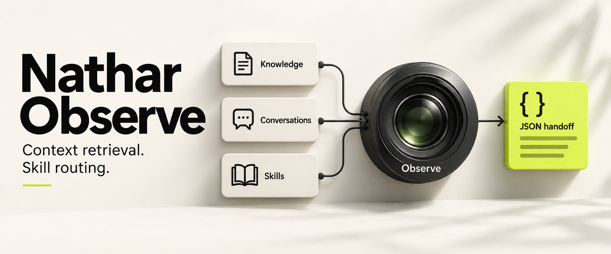
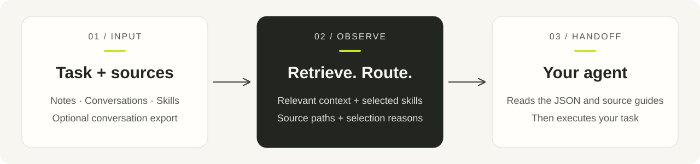

<p align="center">
  
</p>

<p align="center">
  <strong>Give your agent the context and skills to carry out your task.</strong><br>
  السياق المناسب والمهارات المناسبة قبل التنفيذ.
</p>

<p align="center">
  <a href="#quick-start"><strong>Get started</strong></a> &nbsp; / &nbsp;
  <a href="docs/README.ar.md"><strong>الشرح العربي</strong></a> &nbsp; / &nbsp;
  <a href="skills/nathar-observe/SKILL.md">Agent skill</a> &nbsp; / &nbsp;
  <a href="docs/integration.md">Integration</a>
</p>

<p align="center">
  <a href="https://github.com/abuegab1-spec/nathar-observe/actions/workflows/tests.yml"></a>
  
  <a href="LICENSE"></a>
</p>

## One task. Relevant sources. A clear handoff.

Nathar Observe is a CLI and Python library that retrieves local context and routes
tasks to installed `SKILL.md` guides. It tells your agent which files to read,
which skills fit, and why they were selected.

<table>
  <tr>
    <td width="33%" valign="top">
      <h3>01 &nbsp; Retrieve</h3>
      <p>Find relevant notes and optional conversation excerpts in the sources you configure.</p>
    </td>
    <td width="33%" valign="top">
      <h3>02 &nbsp; Route</h3>
      <p>Select installed skill guides that fit the task and its scope.</p>
    </td>
    <td width="33%" valign="top">
      <h3>03 &nbsp; Explain</h3>
      <p>Return source paths, selection reasons, excluded candidates, and retrieval issues.</p>
    </td>
  </tr>
</table>

**Local by default.** Lexical search works offline after installation. Any agent
that can run a command or read JSON can use Observe. Optional semantic indexing,
conversation exports, and wikilink navigation extend the same workflow.

<p align="center">
  
</p>

## Quick start

Requires **Python 3.10+**. Clone, install, and try the included example:

```bash
git clone https://github.com/abuegab1-spec/nathar-observe.git
cd nathar-observe
python -m venv .venv
source .venv/bin/activate
python -m pip install .

nathar-observe --workspace examples/workspace \
  "Review Python parser tests and API validation" --json
```

On Windows PowerShell, activate with `.venv\Scripts\Activate.ps1`.
The example uses synthetic skills and notes and needs no model download or API key.

## See the result

The example selects **`python-testing`** and **`api-review`**, with context from
**`knowledge/parser.md`** and **`knowledge/api.md`**. Your agent follows the
returned reading instructions before carrying out the task.

<details>
<summary><strong>Open the JSON result excerpt</strong></summary>

```json
{
  "status": "ok",
  "discovery_mode": "lexical",
  "selected_skills": ["python-testing", "api-review"],
  "qdrant_hits": [
    {"path": "knowledge/parser.md"},
    {"path": "knowledge/api.md"}
  ]
}
```

This is an excerpt. Full output includes scores, selection details, and reading
instructions. `qdrant_hits` is the context-result field for both backends;
default lexical lookup does not require Qdrant.

</details>

## Make it yours

**Search your workspace**

```bash
nathar-observe --workspace /path/to/project \
  --skills ./skills --knowledge ./knowledge \
  "Review Python parser tests" --json
```

**Give your agent the skill**

Copy [`skills/nathar-observe`](skills/nathar-observe) into your agent's supported
skill directory. The guide explains when to run Observe, how to interpret its
results, and how to read the selected sources and guides.

<details>
<summary><strong>Choose lexical or semantic search</strong></summary>

| | Lexical · default | Semantic · optional |
| --- | --- | --- |
| Matching | Words in skill metadata and notes | Embeddings plus lexical skill matching |
| Setup | Base installation | Semantic extra, model download, and explicit indexing |
| Storage | No search index | Local Qdrant storage or your Qdrant server |
| Languages | Unicode; depends on matching words | Default model is English; translated lookup available |

Follow the [semantic setup guide](docs/usage.md#optional-semantic-search) for
installation and indexing commands.

</details>

## Explore the guides

| Start here | What you will find |
| --- | --- |
| [الشرح العربي](docs/README.ar.md) | الفكرة، التثبيت، وربط ملفاتك خطوة بخطوة |
| [Usage guide](docs/usage.md) | Source configuration, skill format, conversations, graph, semantic search, and Python API |
| [Agent skill](skills/nathar-observe/SKILL.md) | Instructions for an agent using Observe |
| [Integration contract](docs/integration.md) | JSON fields, exit codes, and skill catalogue format |

Observe prepares context and routing. A successful handoff does not verify source
correctness or downstream task completion. Read the [result contract](docs/usage.md#agent-skill-and-result-contract)
for diagnostic behavior and operating limits.

<p align="center"><sub>Independent of agent frameworks · CLI + Python library · <a href="LICENSE">MIT licensed</a></sub></p>
