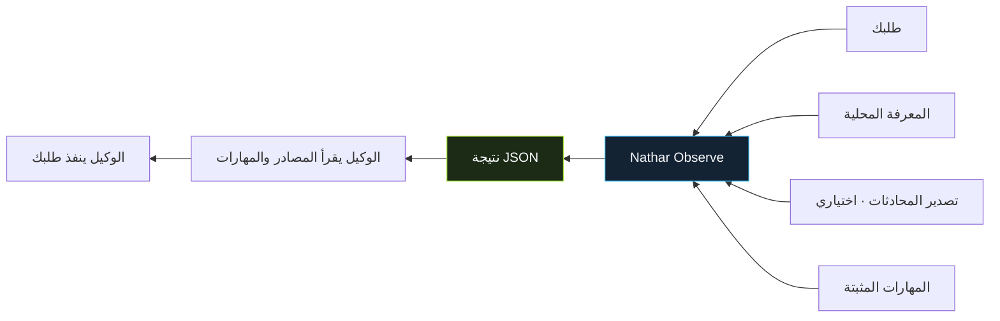

<p align="center">
  
</p>

<h1 align="center">Nathar Observe</h1>

<p align="center"><strong>السياق المناسب والمهارات المناسبة قبل التنفيذ.</strong></p>

<p align="center">
  <a href="../README.md">English</a> ·
  <a href="../skills/nathar-observe/SKILL.md">مهارة الاستخدام</a> ·
  <a href="integration.md">دليل التكامل</a> ·
  <a href="../LICENSE">رخصة MIT</a>
</p>

---

منظومة مستقلة لاسترجاع السياق واختيار المهارات المناسبة لطلب المستخدم.
تعمل مع أي مساعد يقدر يشغّل أوامر أو يقرأ JSON، ولا تحتاج منصة وكلاء محددة.

## الفكرة

تعطيها وصف المهمة ومجلدات المعرفة والمهارات. تبحث عن المصادر ذات الصلة،
وترتّب المهارات، وتوضح أسباب الاختيار والاستبعاد. ترجع للمساعد ملفات
المصادر والمهارات ليقرأها ثم ينفّذ طلب المستخدم الأصلي.

المنظومة تجهّز التنفيذ؛ لا تنفّذ المهمة بنفسها ولا تثبت جودة الناتج.

| تسترجع السياق | تختار المهارات | تشرح النتيجة |
| --- | --- | --- |
| ملاحظات المعرفة ومقتطفات المحادثات التي تحددها. | ملفات المهارات المناسبة لنطاق طلبك. | مسارات المصادر وأسباب الاختيار والاستبعاد وأي مشاكل في البحث. |



## التثبيت والتجربة

تحتاج Python 3.10 أو أحدث. نفّذ داخل مجلد المشروع:

```bash
git clone https://github.com/abuegab1-spec/nathar-observe.git
cd nathar-observe
python -m venv .venv
source .venv/bin/activate
python -m pip install .
nathar-observe --workspace examples/workspace \
  "Review Python parser tests and API validation" --json
```

في Windows PowerShell فعّل البيئة باستخدام `.venv\Scripts\Activate.ps1`.
الوضع الافتراضي يبحث بالكلمات محليًا بعد التثبيت، بدون نموذج أو خادم أو مفتاح API.
الأمثلة المرفقة مصطنعة، وتتيح تجربة المشروع قبل ربطه بملفاتك.

## كيف تبدو النتيجة؟

طلب مراجعة اختبارات محلل Python والتحقق من API يختار المهارتين
`python-testing` و`api-review`، ويشير إلى ملفات المعرفة المرتبطة. هذا
مقتطف مبسط من النتيجة؛ التفاصيل الكاملة تتضمن أسباب الاختيار وتعليمات القراءة:

```json
{
  "status": "ok",
  "discovery_mode": "lexical",
  "selected_skills": ["python-testing", "api-review"],
  "qdrant_hits": [
    {"path": "knowledge/parser.md"},
    {"path": "knowledge/api.md"}
  ]
}
```

اسم الحقل `qdrant_hits` مستخدم لنتائج السياق في الوضعين؛ البحث الافتراضي
بالكلمات لا يحتاج Qdrant.

| الوضع | طريقة البحث | التجهيز |
| --- | --- | --- |
| الكلمات · الافتراضي | تطابق كلمات الطلب مع بيانات المهارات والملاحظات. | التثبيت الأساسي؛ يعمل محليًا بدون فهرسة. |
| الدلالي · اختياري | تشابه المعنى عبر نموذج تضمين مع تطابق كلمات المهارات. | إضافات البحث الدلالي، تنزيل النموذج، وفهرسة صريحة. |

## ربط ملفاتك

ضع المهارات في `skills/<اسم-المهارة>/SKILL.md`، والمعرفة في `knowledge/`.
ثم شغّل:

```bash
nathar-observe --workspace /path/to/project \
  --skills ./skills --knowledge ./knowledge \
  "Review Python parser tests" --json
```

تقدر تكرر `--skills` و`--knowledge` لإضافة مجلدات. المسارات النسبية تُحسب
من مجلد مساحة العمل. مجلدات المعرفة يجب أن تبقى داخله. مجلد المهارات
يمكن أن يكون خارجيًا إذا حددته صراحة.

ملف المهارة يبدأ بمعلومات YAML، مثل:

```markdown
---
name: python-testing
description: Diagnose and test Python parser behavior with pytest.
keywords: [python, pytest, parser]
---

Reproduce the behavior and verify the result.
```

لاكتشاف المهارات فقط استخدم `--skills-only`. لإلزام مهارة موجودة استخدم
`--require-skill python-testing`. غياب مهارة طلبتها صراحة يمنع التسليم.

## البحث الدلالي الاختياري

```bash
python -m pip install '.[semantic]'
nathar-skills --workspace examples/workspace ingest
nathar-vault --workspace examples/workspace ingest
nathar-observe --workspace examples/workspace --backend semantic \
  "Review Python parser tests" --json
```

أول فهرسة تنزّل نموذجًا إنجليزيًا. تُحفظ الفهارس محليًا داخل
`.nathar-observe/` ولا تحتاج خادم Qdrant. للطلبات العربية مع هذا النموذج،
استخدم `--search-query` بصياغة إنجليزية تحفظ معنى الطلب ونطاقه.
البحث بالكلمات يدعم Unicode، لكنه يعتمد على وجود كلمات متطابقة في ملفاتك.

## المحادثات والعلاقات

حدد تصدير محادثات JSONL باستخدام `--conversations conversations.jsonl`.
كل سطر يحتوي `session_id` و`message_id` و`role` و`text`. المشروع لا يقرأ
تخزين محادثات أي منصة تلقائيًا.

لبناء علاقات `[[wikilinks]]` بين الملاحظات:

```bash
nathar-graph --workspace examples/workspace build
```

هذه العملية تنشئ فهرسًا ولا تعدّل الملاحظات.

## مهارة الاستخدام

انسخ مجلد [مهارة Nathar Observe](../skills/nathar-observe) إلى مجلد المهارات
الذي يدعمه مساعدك. تحتوي إرشادات تشغيل المنظومة وفهم نتائجها وقراءة
المهارات المرشحة، بصيغة مستقلة عن منصات الوكلاء.

النتيجة تعرض المهارات والمصادر والمحادثات والمشكلات. كود الخروج `0`
يعني اكتمال التوجيه، و`2` يعني نقصًا في الاسترجاع، و`1` يعني خطأً أو
متطلبًا مانعًا. نجاح التوجيه لا يعني أن المصادر صحيحة أو أن المهمة نُفّذت.

راجع [الشرح الإنجليزي الكامل](../README.md) و[عقد التكامل](integration.md)
لإعدادات Python والبحث الدلالي وصيغة النتائج.

---

المشروع مستقل عن منصات الوكلاء، ومتاح للاستخدام والتعديل تحت [رخصة MIT](../LICENSE).
